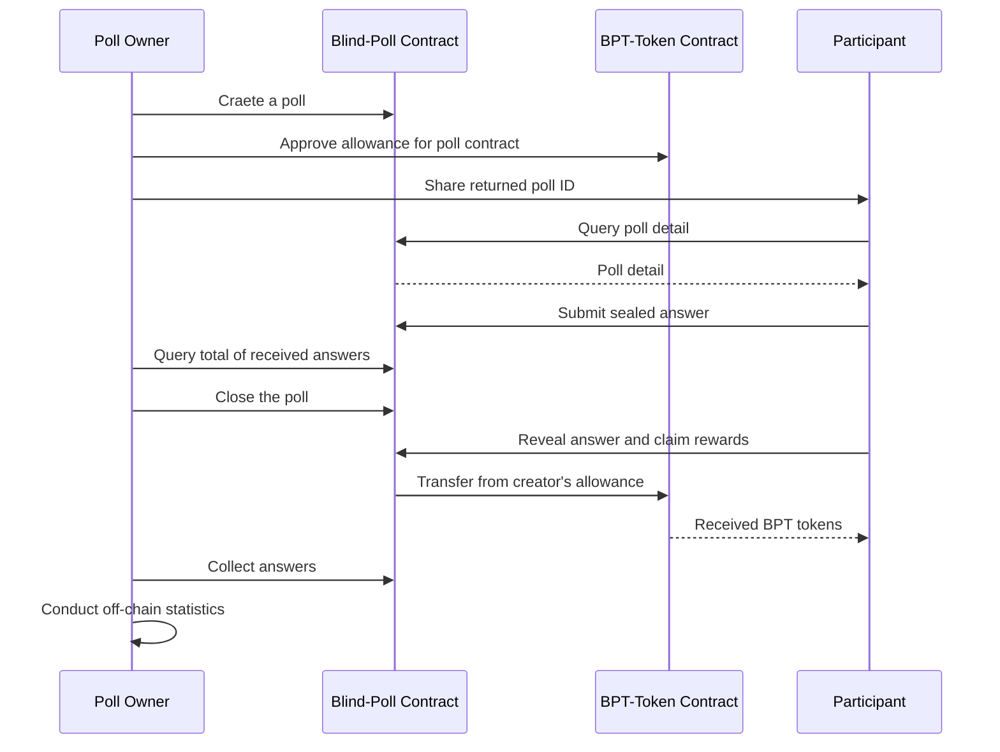

# Blind Poll

Smart contract written in [Clarity](https://docs.blockstack.org/core/smart/clarityref) for [BlockStack](<(https://docs.blockstack.org)>).

## Introduction

The Blind Poll smart contract enables users to host anonymous polls. Also, it comes with a fungible token named as BPT (Blind Poll Token). To incentivize users to participate in the poll, the poll creator could choose to put aside some amount of BPT token as rewards for each valid participation, which will get distributed when participant reveal their answers.

Note that the total of rewards is approved by the poll creator as allowance of this contract when creating a new poll. Therefore, if the balance of the creator's principal is not sufficient when participants claim rewards, the creator won't be able to receive revealed answers, since the actions of reveal and claim are bound to a single transaction.

The Poll structure defined in the contract includes the following fields:

- subject(buff 128): string to illustrate the topic of the poll
- ~~start-time(unit): default to the time when the block got mined~~ (preserved)
- ~~duration(unit): in seconds, the span of time a poll should last for~~ (preserved)
- ~~claim-duration(unit): in seconds, the period when participants could reveal answers and claim rewards~~ (preserved)
- rewards(uint): the amount of BPT as rewards for each participant
- max-count(uint): maximum of acceptable answers in total
- questions(buff 5120): raw bytes of encoded question

To be noted, how to encode/decode **questions** field of a poll and associated **answers** should be decided by dApp developers, the contract simply store them as raw bytes. Besides, **start-time** and **duration** fields are initially designed to conduct the automatic check for the poll lifecycle, but are not used for now, since **get-block-info** API does not work as expected.

## Features / Use Cases

Functionalities the contract provides include:

### As a poll creator

- Create a new poll with and optionally distribute reward in BPT to participants
- Query ID of last created poll for later interactions
- Close the poll at any time
- Query the total of sealed or revealed answers, and iterate over all revealed answers

### As a poll participant

- Query poll detail by ID
- Join in an ongoing poll and submit a sealed answer for it
- Reveal an answer submitted before and claim rewards after the poll closes

## Sequential Diagram

The overall workflow of poll hosting is demonstrated in the following diagram.



## Error Codes

| Code  | Thrown When                                                                                                           |
| ----- | --------------------------------------------------------------------------------------------------------------------- |
| -1001 | a principal tries to create a new poll before the previous one closes                                                 |
| -1002 | a principal tries to submit more than one answers for the same poll, or received submissions have reached the maximum |
| -1003 | a principal tries to reveal answers sealed by other users or with incorrect hash                                      |
| -1004 | a principal tries to reveal and claim for the same poll more than once                                                |

## Constraints

- One principal could only host one active poll at the same time, considering limited supports for List in Clarity right now.
- DApp developers should define its own encoding/decoding methods for **questions** and associated **answers,** while the contract just store these two fields as raw bytes.

## APIs

### create-poll-with-guard

```
(subject (buff 128))
(rewards uint)
(max-count uint)
(questions (buff 5120))
```

### close-poll

```
(pid uint)
```

### submit-answer-sealed

```
(pid uint)
(answer-sealed (buff 32))
```

### reveal-answer

```
(pid uint)
(sealed (buff 32))
(answer (buff 512))
```

### query-answer-count-sealed

```
(pid uint)
```

### query-answer-count-revealed

```
(pid uint)
```

### query-answer-by-index

```
(pid uint)
(i uint)
```

## Tests

There're two test suites included in the test script, one for normal poll hosting workflow, the other for exceptional cases.


## Examples

Comprehensive tests have been included in the test script, to which you could refer.
