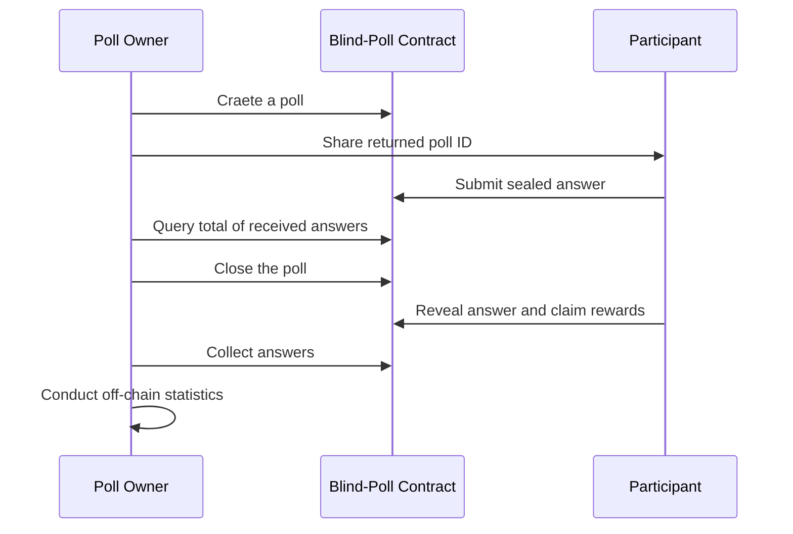

# Blind Poll

Smart contracts written in [Clarity](https://docs.blockstack.org/core/smart/clarityref) for [BlockStack]((https://docs.blockstack.org)).

## Introduction

The Blind Poll smart contracts enable users to host anonymous polls. To incentivize users to participate in the poll, the initiator could choose to put aside some amount of STX token as rewards for each valid participation, which will get distributed after the poll concludes. 

Poll defined in the contract includes following fields:

- subject(buff 128): to demonstrate what the poll's about
- startTime(unit): default to the time when the block got mined
- duration(unit): in seconds, how long should the poll last for?
- rewards(uint): amount of STX as incentive for each participant, whcih get distributed after the poll concludes
- questions(buff 5124): encoded question

Notice that, how to encode/decode **questions** field of a poll and associated **answers** field should be decided by dApp developers, the contract simply treat it as raw bytes. Besides, since **get-block-info** API does not work as expected, automatic time check is replaced by manual call for poll lifecycle management.

## Features / Use Cases

Functionalities the contracts provide include:

### As a poll creator

- Create a new poll with and optionally distribute reward in STX to participant
- Query last created poll ID for later interactions
- Close the poll at any time
- Query the total of sealed or revealed answers, and iterate over all revealed answers

### As a poll participant

- Query poll detail by ID
- Join in an ongoing poll and submit a sealed answer for it
- Reveal a answer submitted before and claim rewards after the poll closes

## Sequential Diagram



## Constraints

- One principal could only host one active poll at the same time, considering limited supports for List in Clarity right now.
- DApp developers should define its own encoding/decoding methods for poll **questions** and **answers,** while the contract just treat these two fields as raw bytes
- Rewards distribution not implemented yet
- Time check not implemented yet since **get-block-info** API does not work as expected

## Error Codes

| Code  | Thrown When                                                                                                                |
| ----- | -------------------------------------------------------------------------------------------------------------------------- |
| -1001 | a principal tries to submit more than one answers for the same poll, or when the answers receveid have reached the maximum |
| -1002 | a principal tries to submit more than one answers for the same poll, or when the answers receveid have reached the maximum |
| -1003 | a principal tries to reveal answers sealed by other users or with incorrect hash                                           |
| -1004 | a princial who hasn't create a poll before tries to query last poll ID                                                     |

## APIs

### create-poll-with-guard

```
(subject (buff 128))
(rewards uint)
(max-count uint)
(questions (buff 5120))
```

### close-poll

```
(pid uint)
```

### submit-answer-sealed

```
(pid uint)
(answer-sealed (buff 32))
```

### reveal-answer

```
(pid uint)
(sealed (buff 32))
(answer (buff 512))
```

### query-answer-count-sealed

```
(pid uint)
```

### query-answer-count-revealed

```
(pid uint)
```

### query-answer-by-index (pid uint)

```
(i uint)
```

## Examples

Comprehensive tests have been included in the repo, to which you could refer.
